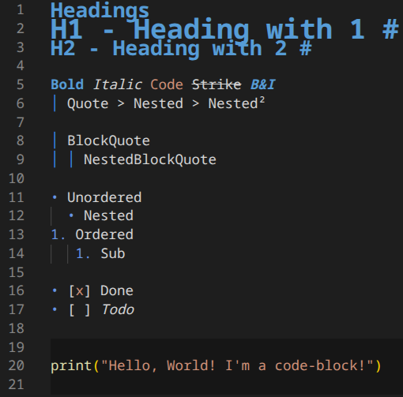
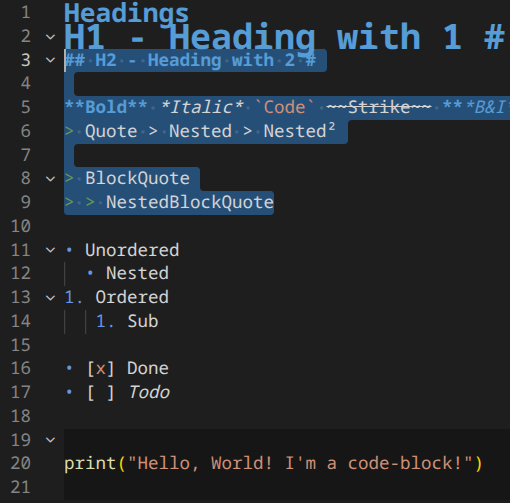

# Markdown Inline Editor [![CI/CD Status][ci-img]][ci] [](LICENSE.txt)


Write Markdown like a rich text editor—see **bold**, *italic*, and `code` styled inline while syntax markers stay hidden. Click to edit raw Markdown. Your files stay 100% standard `.md`.

**Why?** Less clutter, more focus. Git-friendly. Works everywhere.

### Key Features

* **Hide syntax** – No more `**`, `~~`, backticks cluttering your view
* **Smart reveal** – Click any text to instantly see/edit raw Markdown  
* **Fast** – Intelligent caching, no lag
* **Compatible** – Standard `.md` files, works with any tool
* **Theme-aware** – Adapts to your VS Code theme

## Demo

<p align="center">
  
</p>

<p align="center">
  
  
</p>

## What You Get

- **Hidden syntax** – `**bold**`, `*italic*`, `~~strike~~` → see the formatting, not the markers
- **Styled headings** – `# H1` through `###### H6` sized appropriately  
- **Clean links** – `[text](url)` → clickable text, URL hidden
- **Visual lists** – `- item` → • item
- **Code blocks** – Fences hidden, background styled
- **Instant reveal** – Select text to see/edit raw Markdown
- **Fast** – Caching + incremental updates
- **Toggle anytime** – 👁️ toolbar button

## Recommended additional Extensions

Enhance your Markdown workflow with these complementary extensions:

- **[Markdown All in One](https://marketplace.visualstudio.com/items?itemName=yzhang.markdown-all-in-one)**
    - Keyboard shortcuts (e.g., <kbd>Alt</kbd>+<kbd>C</kbd> to toggle checkboxes)
    - Auto-formatting
    - Table of contents generator
    - Markdown preview
    - Many more productivity features

- **[Mermaid Chart](https://marketplace.visualstudio.com/items?itemName=MermaidChart.vscode-mermaid-chart)**
    - Create and edit diagrams directly within Markdown
    - Preview and quickly iterate on charts
    - Great for including diagram context for AI/colleagues


## Install

**VS Code Marketplace:**
1. Extensions → Search "Markdown Inline Editor" → Install

**Quick Open:**  
Press `Ctrl+P` / `Cmd+P`, type `ext install CodeSmith.markdown-inline-editor-vscode`

## Usage

1. Open any `.md` file
2. Start typing—formatting is automatic
3. Click/select text to reveal raw Markdown
4. Use 👁️ toolbar icon to toggle decorations on/off

## Supported Markdown

| Syntax | Example | Result |
|--------|---------|--------|
| Bold | `**text**` | **text** (markers hidden) |
| Italic | `*text*` | *text* (markers hidden) |
| Strikethrough | `~~text~~` | ~~text~~ (markers hidden) |
| Code | `` `code` `` | `code` (monospace) |
| Headings | `# H1` ... `###### H6` | Sized text |
| Links | `[text](url)` | Clickable, URL hidden |
| Images | `` | Alt text styled |
| Lists | `- item` | • item |
| Task Lists | `- [ ]` / `- [x]` | ☐ / ☑ |
| Blockquotes | `> quote` | │ quote |
| Horizontal Rules | `---` | ─────── |
| Code Blocks | ` ```lang ` | Background styled, fences hidden |

Nested formatting fully supported (e.g., **bold *italic***).

## Configuration

No setup needed—works out of the box. Auto-adapts to your VS Code theme.

## Development

**Prerequisites:** Node.js 20+, VS Code 1.88.0+

```bash
git clone https://github.com/SeardnaSchmid/markdown-inline-editor-vscode.git
cd markdown-inline-editor-vscode
npm install
npm run compile
npm test
```

**Key Commands:**
- `npm run compile` – Build
- `npm test` – Run tests
- `npm run package` – Create `.vsix`

**Architecture:**
```
src/
├── extension.ts      # Entry point
├── parser.ts         # Markdown AST (remark-based)
├── decorator.ts      # Decorations & caching
├── decorations.ts    # VS Code decoration types
└── parser/__tests__/ # 100+ test cases
```

See [`AGENTS.md`](AGENTS.md) for contribution guidelines and agent roles.

## Troubleshooting

**Decorations not showing?**
- Check file is `.md`, `.markdown`, or `.mdx`
- Click 👁️ toolbar icon to toggle
- Reload window (`Ctrl/Cmd+Shift+P` → "Reload Window")

**Performance issues?**
- Large files (>1MB) may be slower
- Temporarily disable with 👁️ icon
- Check `Help` → `Startup Performance`

**Found a bug?** Open an [issue](https://github.com/SeardnaSchmid/markdown-inline-editor-vscode/issues).

## Contributing

Contributions welcome! Use [Conventional Commits](https://www.conventionalcommits.org/):

```bash
git checkout -b feat/my-feature
# Make changes, write tests
npm test && npm run lint
git commit -m "feat(parser): add definition list support"
```

**Commit types:** `feat`, `fix`, `docs`, `perf`, `test`, `refactor`

See [`AGENTS.md`](AGENTS.md) for agent roles and guidelines.

## License

MIT License – See [LICENSE.txt](LICENSE.txt)

## Acknowledgments

Built with [remark](https://github.com/remarkjs/remark), [unified](https://github.com/unifiedjs/unified), and the [VS Code Extension API](https://code.visualstudio.com/api).

---

**Your files remain standard `.md` – this extension only affects the editor view.**

[ci-img]: https://github.com/SeardnaSchmid/markdown-inline-editor-vscode/actions/workflows/ci.yaml/badge.svg
[ci]: https://github.com/SeardnaSchmid/markdown-inline-editor-vscode/actions/workflows/ci.yaml