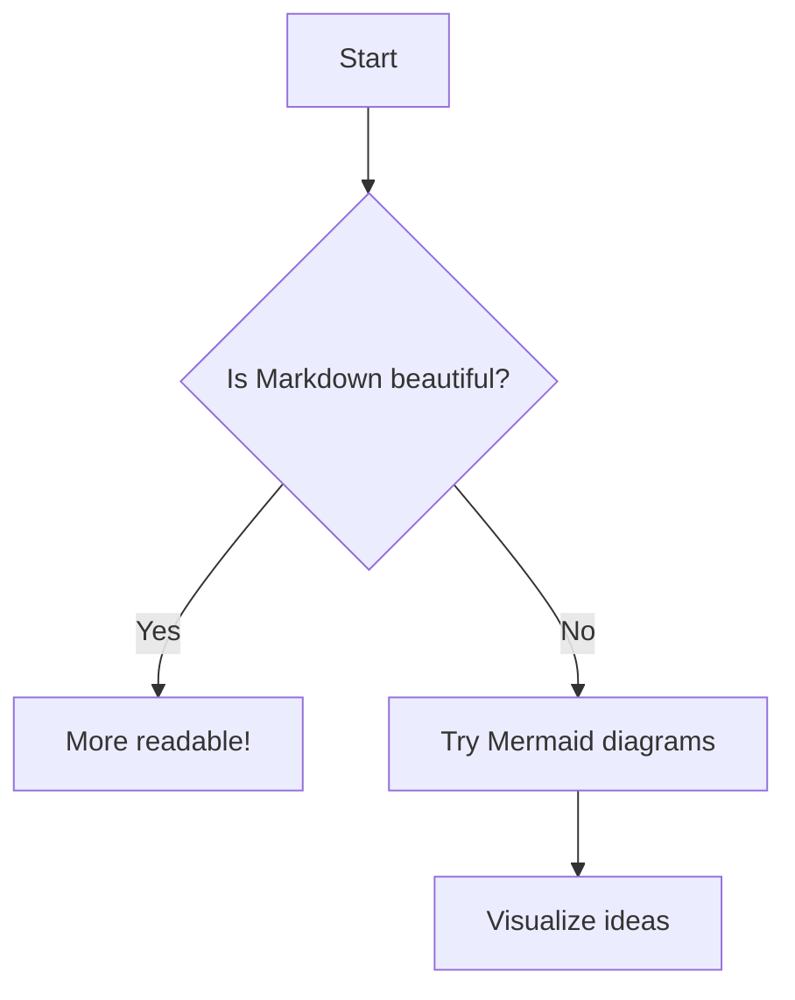
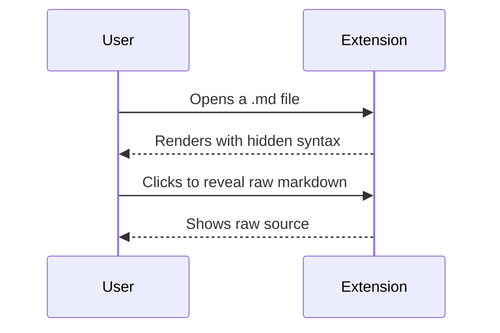
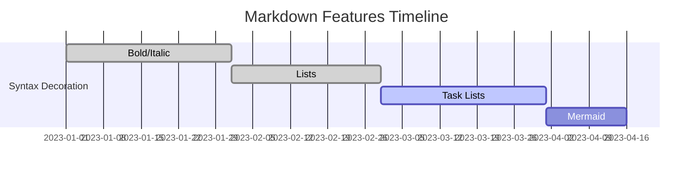

# Markdown Example

## Headings
# H1
## H2
### H3
...

## Text Formatting
**Bold** *Italic* `Code` ~~Strikethrough~~ 
***Bold & Italic*** **_Bold & Italic (nested)_** 
~~**Bold in Strikethrough**~~ **~~Bold and Strikethrough (nested)~~**

## Blockquote
> Quote
> > Nested Quote
> > > Nested² Quote

## Lists
- Unordered
  - Nested
1. Ordered
2. Some other thing
   1. Nested Orders

- [x] Task done
- [ ] Todo italic *nested*

## Code Block
```python
print("Hello, World!")
```

## Table
| A | B |
|---|---|
| X | Y |

## Mermaid Charts








